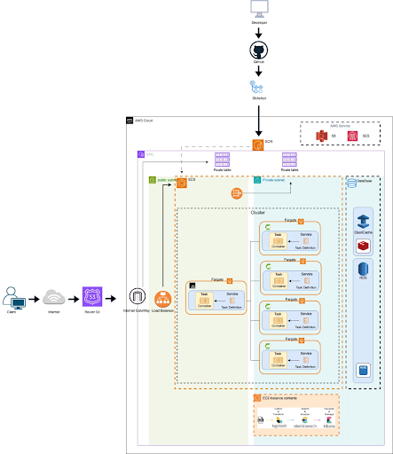
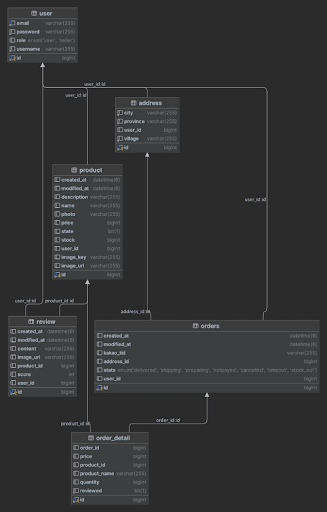

### 📄 개요

---

# 

- 프로젝트 이름 : 10-trillion-dollars
- 프로젝트 기간 : 24.3.26 ~ 24.4.30
- 프로젝트 설명 :  "다양한 상품과 편리한 서비스로 고객들을 만족시키는 이커머스 플랫폼”

### ⚙개발환경

---

-  : 주 언어로 사용되었습니다.
-  : 프로젝트의 백엔드 개발에 사용되었습니다
- -  : 프로젝트의 메인 프레임워크로 사용되었습니다.
- -  : 보안 기능을 구현하는 데 사용되었습니다.
- -  : 클라우드 환경에서의 마이크로서비스 아키텍처를 구현하는 데 사용되었습니다.
-  : 데이터베이스 ORM(Object-Relational Mapping) 프레임워크로 사용되었습니다.
-  : 관계형 데이터베이스로 사용되었습니다.
-  : 캐싱 및 락 관리를 위해 사용되었습니다.
-  : 애플리케이션의 컨테이너화를 위해 사용되었습니다.
-  : CI/CD 파이프라인을 구축하는 데 사용되었습니다.
-  : 애플리케이션의 서버 호스팅에 사용되었습니다.
-  : Docker 컨테이너를 실행하고 관리하기 위해 사용되었습니다.
-  : Docker 이미지 저장소로 사용되었습니다.
-  : FATGATE : 프로젝트의 웹 서버로 사용되었습니다.
-  : 정적 파일 및 미디어 파일을 저장하는 데 사용되었습니다.
-  : 관계형 데이터베이스 서비스로 사용되었습니다.
-  : 캐싱 서비스로 사용되었습니다.
-  : 도메인 관리와 DNS 서비스에 사용되었습니다.
-  : 트래픽을 분산하는 데 사용되었습니다.
-  : 이메일 서비스를 제공하는 데 사용되었습니다.
-  : 검색 기능을 구현하는 데 사용되었습니다.
-  : 로그 데이터를 수집, 처리 및 저장하는 데 사용되었습니다.
-  : 데이터 시각화 및 분석 도구로 사용되었습니다.
-  : 프론트엔드 개발에 사용되었습니다.

### 🔥 아키텍쳐

### ✨기능 구현
*****

  
유저 도메인

1. 회원가입 / 로그인
2. 프로필 수정
3. 회원 탈퇴
4. 로그아웃

  
주소 도메인

1. 주소 생성
2. 주소 수정
3. 주소 삭제

  
상품 도메인

일반 유저

1. 상품 전체 조회(페이징 처리)
2. 상품 단건 상세 조회
3. 상품 검색 기능 

---

관리자 유저

1. 상품 생성
2. 관리자 상품 전체 조회(페이징 처리)
3. 상품 수량 변경
4. 상품 삭제

  
주문 도메인

일반 유저

1. 주문 생성
2. 주문 조회
3. 주문 취소

---

관리자 유저

1. 주문 상태 변경

  
리뷰 도메인

1. 리뷰 생성
2. 리뷰 수정
3. 리뷰 삭제
4. 리뷰 이미지 등록
5. 리뷰 이미지 수정

### 👩🏼‍🤝‍👩🏼멤버 구성
**************
<table>
    <tbody>
        <tr>
            <td align="center"><a href="https://github.com/SerenityZenDev"> <b> 전석배 </b></a> </td>
            <td align="center"><a href="https://github.com/JooJuneHo"> <b> 주준호 </b></a> </td>
            <td align="center"><a href="https://github.com/pie0902"> <b> 윤종일 </b></a> </td>
            <td align="center"><a href="https://github.com/Ssuminn"> <b> 박수민 </b></a> </td>
            <td align="center"><a href="https://github.com/tylerson07"> <b> 손영효 </b></a> </td>
    </tr>
    </tbody>
</table>

* 전석배 - 상품 도메인, MSA 구성, ELK, FRONT
* 주준호 - 유저 도메인, CI/CD 구축, DOCKER, HTTPS 적용, 쿼리 개선
* 윤종일 - 리뷰 도메인, 캐싱, 동시성 제어, FRONT, SES
* 박수민 - 주소 도메인, CI/CD 구축, DOCKER, HTTPS 적용, 부하 테스트
* 손영효 - 주문 도메인, S3, 결제 모듈(카카오 API), 테스트 코드 작성(E2E)

### 📚 ERD 다이어그램

